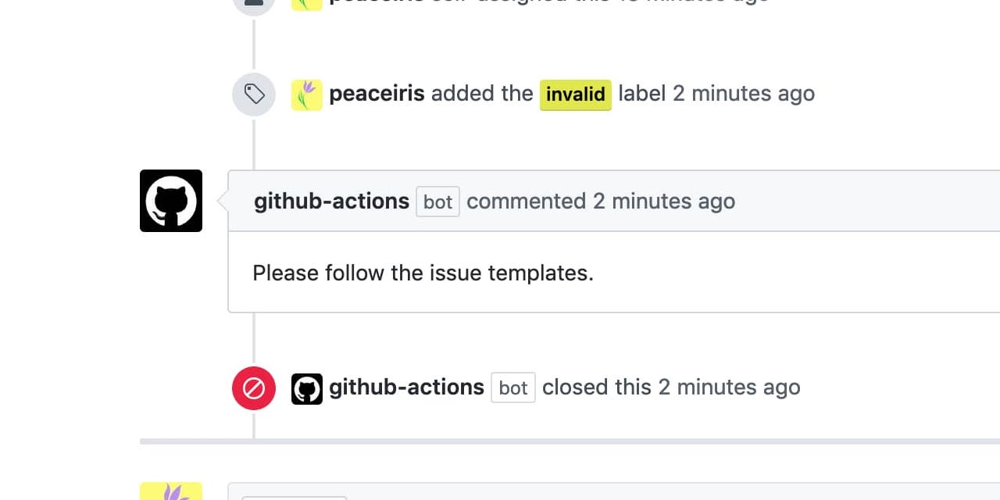

[](https://github.com/peaceiris/actions-label-commenter/blob/master/LICENSE)
[](https://github.com/peaceiris/actions-label-commenter/releases/latest)
[](https://github.com/peaceiris/actions-label-commenter/releases)
[](https://github.com/peaceiris/actions-label-commenter/releases.atom)
[](https://dependabot.com)




## Label Commenter Action

This action is one of label triggered GitHub Actions for posting a template message. After commenting, it can automatically close or reopen issues. Of course, it also can manage pull requests.

This Action was submitted to the [GitHub Actions Hackathon](https://github.blog/2020-02-27-were-challenging-you-to-create-your-very-own-github-actions/).


## Table of Contents

<!-- START doctoc generated TOC please keep comment here to allow auto update -->
<!-- DON'T EDIT THIS SECTION, INSTEAD RE-RUN doctoc TO UPDATE -->


- [Getting Started](#getting-started)
  - [Workflow Setting](#workflow-setting)
  - [Action Setting](#action-setting)
- [Examples](#examples)
  - [Comment and Close Invalid Format Issue or Pull Request](#comment-and-close-invalid-format-issue-or-pull-request)
  - [Reopen Issue or Pull Request](#reopen-issue-or-pull-request)
  - [Comment and Close Wontfix Issue or Pull Request](#comment-and-close-wontfix-issue-or-pull-request)
  - [Comment and Close Duplicate Issue or Pull Request](#comment-and-close-duplicate-issue-or-pull-request)
  - [Comment Multiple Line](#comment-multiple-line)
  - [Close Multiple Issues or Pull Requests](#close-multiple-issues-or-pull-requests)
- [Changelog](#changelog)
- [License](#license)
- [Maintainer](#maintainer)

<!-- END doctoc generated TOC please keep comment here to allow auto update -->


## Getting Started

Create your GitHub Actions workflow file and Label Commenter Action setting file. Commit those and push to the remote master branch.

### Workflow Setting

```yaml
# .github/workflows/label-commenter.yml

name: Label Commenter

on:
  issues:
    types:
      - labeled
      - unlabeled
  pull_request:
    types:
      - labeled
      - unlabeled

jobs:
  comment:
    runs-on: ubuntu-18.04
    steps:
      - uses: actions/checkout@v2
        with:
          ref: master

      - name: Label Commenter
        uses: peaceiris/actions-label-commenter@v1
        with:
          github_token: ${{ secrets.GITHUB_TOKEN }}
          # config_file: .github/label-commenter-config.yml
```

For the `pull_request` event from forks, we need to use a personal access token instead of `GITHUB_TOKEN`. The generated `GITHUB_TOKEN` on a fork has no write permission. See the official documentation for more details. [Authenticating with the GITHUB_TOKEN - GitHub Help](https://help.github.com/en/actions/configuring-and-managing-workflows/authenticating-with-the-github_token)

### Action Setting

```yaml
# .github/label-commenter-config.yml

labels:
  - name: invalid
    labeled:
      issue:
        body: Please follow the issue templates.
        action: close
      pr:
        body: Please follow the pull request templates.
        action: close
    unlabeled:
      issue:
        body: Thank you for following the template. The repository owner will reply.
        action: open
  - name: forum
    labeled:
      issue:
        body: |
          Please ask questions about GitHub Actions at the following forum.
          https://github.community/t5/GitHub-Actions/bd-p/actions
        action: close
  - name: wontfix
    labeled:
      issue:
        body: This will not be worked on but we appreciate your contribution.
        action: close
    unlabeled:
      issue:
        body: This has become active again.
        action: open
  - name: duplicate
    labeled:
      issue:
        body: This issue already exists.
        action: close
  - name: good first issue
    labeled:
      issue:
        body: This issue is easy for contributing. Everyone can work on this.
```

<div align="right">
<a href="#table-of-contents">Back to TOC ☝️</a>
</div>


## Examples

### Comment and Close Invalid Format Issue or Pull Request


### Reopen Issue or Pull Request


### Comment and Close Wontfix Issue or Pull Request


### Comment and Close Duplicate Issue or Pull Request


### Comment Multiple Line


### Close Multiple Issues or Pull Requests

| Select Label | Labeled |
|---|---|
|  |  |

Multiple issues will be closed.


<div align="right">
<a href="#table-of-contents">Back to TOC ☝️</a>
</div>


## Changelog

- [CHANGELOG.md](./CHANGELOG.md)


## License

- [MIT License - peaceiris/actions-label-commenter](https://github.com/peaceiris/actions-label-commenter/blob/master/LICENSE)


## Maintainer

- [peaceiris homepage](https://peaceiris.com/)

<div align="right">
<a href="#table-of-contents">Back to TOC ☝️</a>
</div>
