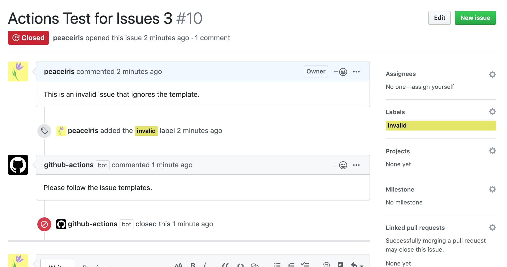
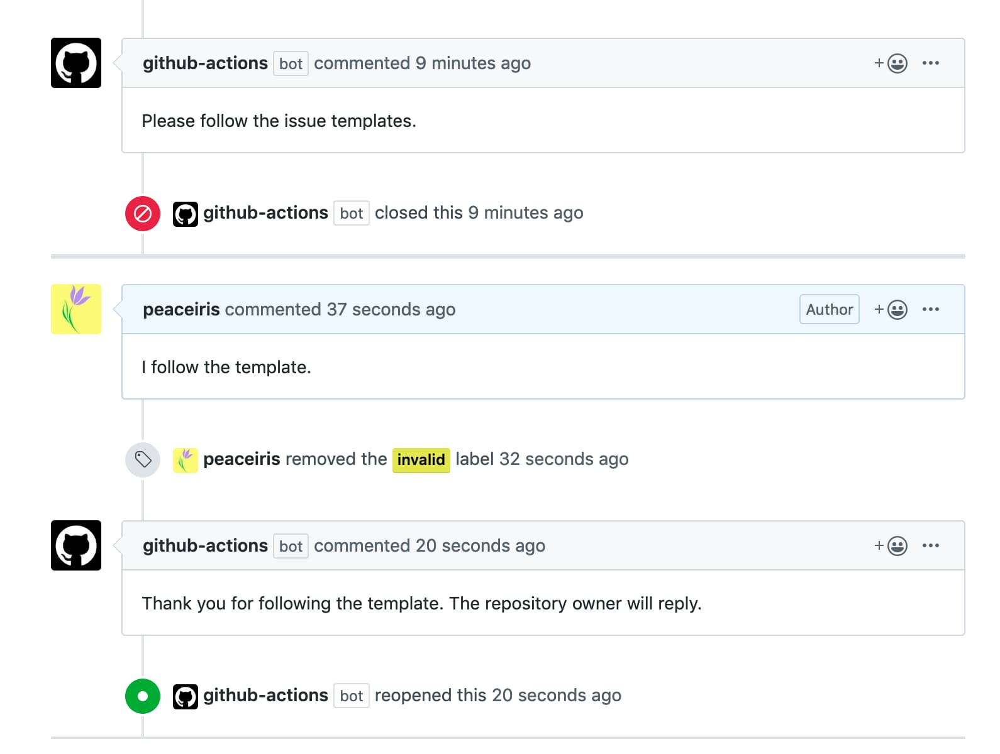
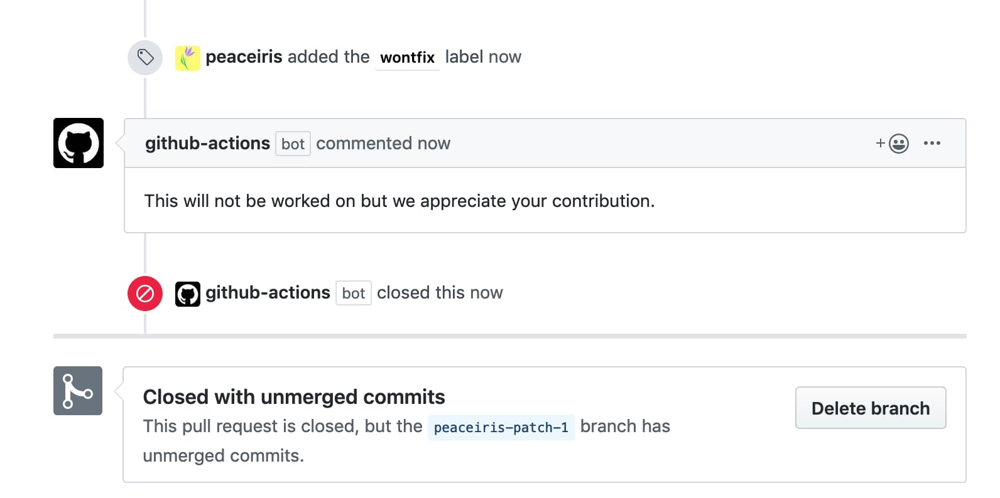
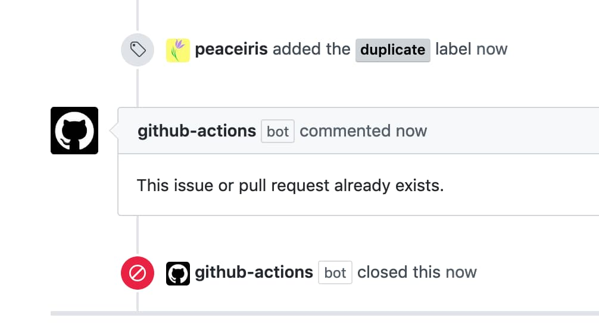
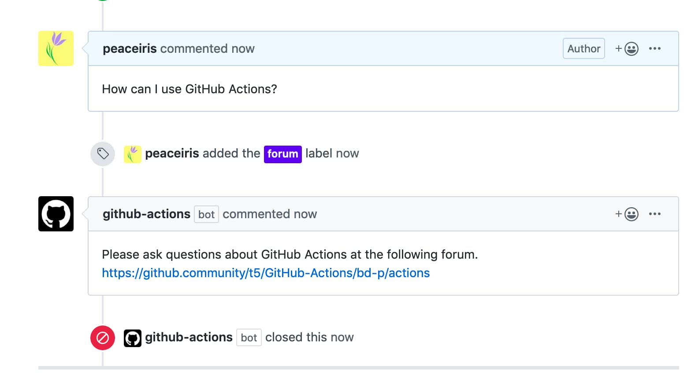
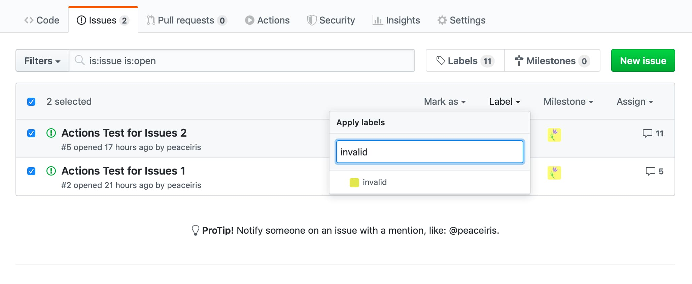
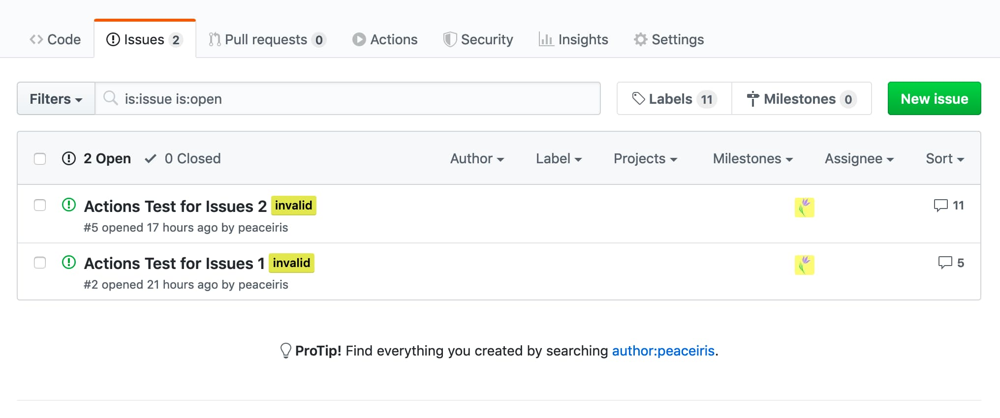
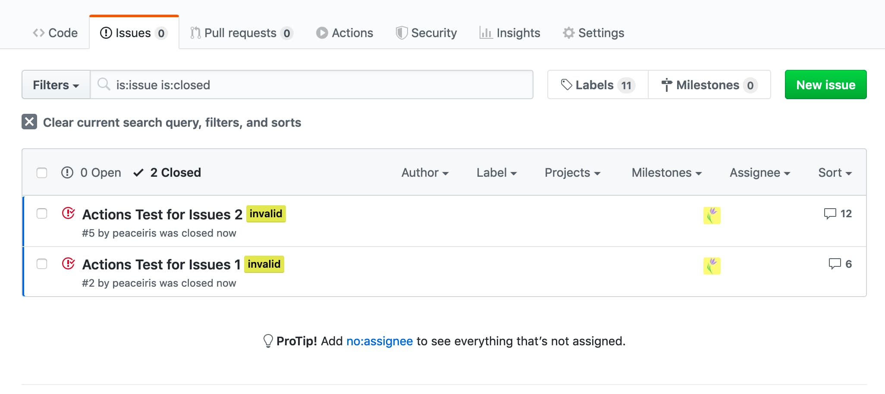
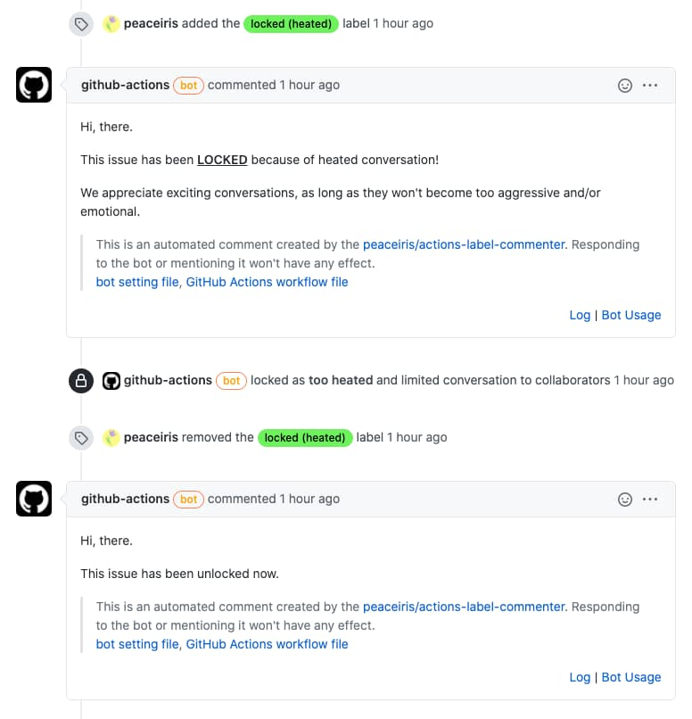

<h2 align="center">
Label Commenter Action
</h2>

<div align="center">
  
</div>

[](https://github.com/peaceiris/actions-label-commenter/blob/main/LICENSE)
[](https://github.com/peaceiris/actions-label-commenter/releases/latest)
[](https://github.com/peaceiris/actions-label-commenter/releases)
[](https://github.com/peaceiris/actions-label-commenter/releases.atom)

This action is one of label triggered GitHub Actions for posting a template message. After commenting, it can automatically close or reopen issues. Of course, it also can manage pull requests.

This Action was submitted to the [GitHub Actions Hackathon] and featured by GitHub. ([Featured actions from the GitHub Actions Hackathon - The GitHub Blog])

[GitHub Actions Hackathon]: https://github.blog/2020-02-27-were-challenging-you-to-create-your-very-own-github-actions/
[Featured actions from the GitHub Actions Hackathon - The GitHub Blog]: https://github.blog/2020-04-09-featured-actions-from-the-github-actions-hackathon/


## Table of Contents

<!-- START doctoc generated TOC please keep comment here to allow auto update -->
<!-- DON'T EDIT THIS SECTION, INSTEAD RE-RUN doctoc TO UPDATE -->


- [Getting Started](#getting-started)
  - [Workflow Setting](#workflow-setting)
  - [Action Setting](#action-setting)
- [Options](#options)
  - [Set a Path to Action Setting File](#set-a-path-to-action-setting-file)
  - [Set a Personal Access Token](#set-a-personal-access-token)
  - [Enable Debug Mode](#enable-debug-mode)
- [Work with Other Auto Label Actions](#work-with-other-auto-label-actions)
- [Examples](#examples)
  - [Comment and Close Invalid Format Issue or Pull Request](#comment-and-close-invalid-format-issue-or-pull-request)
  - [Reopen Issue or Pull Request](#reopen-issue-or-pull-request)
  - [Comment and Close Wontfix Issue or Pull Request](#comment-and-close-wontfix-issue-or-pull-request)
  - [Comment and Close Duplicate Issue or Pull Request](#comment-and-close-duplicate-issue-or-pull-request)
  - [Comment Multiple Line](#comment-multiple-line)
  - [Comment and Close Multiple Issues or Pull Requests](#comment-and-close-multiple-issues-or-pull-requests)
  - [Lock or Unlock issue or Pull Request](#lock-or-unlock-issue-or-pull-request)
- [Changelog](#changelog)
- [License](#license)
- [Maintainer](#maintainer)

<!-- END doctoc generated TOC please keep comment here to allow auto update -->

> Table of Contents are generated with [DocToc](https://github.com/thlorenz/doctoc)


## Getting Started

Create your GitHub Actions workflow file and Label Commenter Action setting file. Commit those and push to the remote default branch.

### Workflow Setting

```yaml
# .github/workflows/label-commenter.yml

name: Label Commenter

on:
  issues:
    types:
      - labeled
      - unlabeled
  pull_request_target:
    types:
      - labeled
      - unlabeled

jobs:
  comment:
    runs-on: ubuntu-18.04
    steps:
      - uses: actions/checkout@v2
        with:
          ref: main

      - name: Label Commenter
        uses: peaceiris/actions-label-commenter@v1
        # with:
          # config_file: .github/label-commenter-config.yml
```

### Action Setting

```yaml
# .github/label-commenter-config.yml

comment:
  header: Hi, there.
  footer: |
    > This is an automated comment created by the [peaceiris/actions-label-commenter]. Responding to the bot or mentioning it won't have
    > [bot setting file], [GitHub Actions workflow file]

    [peaceiris/actions-label-commenter]: https://github.com/peaceiris/actions-label-commenter
    [bot setting file]: https://github.com/peaceiris/actions-label-commenter/blob/main/.github/label-commenter-config.yml
    [GitHub Actions workflow file]: https://github.com/peaceiris/actions-label-commenter/blob/main/.github/workflows/label-commenter.yml

labels:
  - name: invalid
    labeled:
      issue:
        body: Please follow the issue templates.
        action: close
      pr:
        body: Thank you @{{ pull_request.user.login }} for suggesting this. Please follow the pull request templates.
        action: close
    unlabeled:
      issue:
        body: Thank you for following the template. The repository owner will reply.
        action: open
  - name: forum
    labeled:
      issue:
        body: |
          Please ask questions about GitHub Actions at the following forum.
          https://github.community/c/github-actions
        action: close
  - name: wontfix
    labeled:
      issue:
        body: This will not be worked on but we appreciate your contribution.
        action: close
    unlabeled:
      issue:
        body: This has become active again.
        action: open
  - name: duplicate
    labeled:
      issue:
        body: This issue already exists.
        action: close
  - name: good first issue
    labeled:
      issue:
        body: This issue is easy for contributing. Everyone can work on this.
  - name: proposal
    labeled:
      issue:
        body: Thank you @{{ issue.user.login }} for suggesting this.
  - name: locked (spam)
    labeled:
      issue:
        body: |
          This issue has been **LOCKED** because of spam!

          Please do not spam messages and/or issues on the issue tracker. You may get blocked from this repository for doing so.
        action: close
        locking: lock
        lock_reason: spam
      pr:
        body: |
          This pull-request has been **LOCKED** because of spam!

          Please do not spam messages and/or pull-requests on this project. You may get blocked from this repository for doing so.
        action: close
        locking: lock
        lock_reason: spam
  - name: locked (heated)
    labeled:
      issue:
        body: |
          This issue has been **LOCKED** because of heated conversation!

          We appreciate exciting conversations, as long as they won't become too aggressive and/or emotional.
        locking: lock
        lock_reason: too heated
      pr:
        body: |
          This pull-request has been **LOCKED** because of heated conversation!

          We appreciate exciting conversations, as long as they won't become too aggressive and/or emotional.
        locking: lock
        lock_reason: too heated
    unlabeled:
      issue:
        body: |
          This issue has been unlocked now.
        locking: unlock
      pr:
        body: |
          This pull-request has been unlocked now.
        locking: unlock
  - name: locked (off-topic)
    labeled:
      issue:
        body: |
          This issue has been **LOCKED** because of off-topic conversations!

          Please use our other means of communication for casual chats.
        action: close
        locking: lock
        lock_reason: off-topic
  - name: locked (resolved)
    labeled:
      issue:
        body: |
          This issue has been **LOCKED** because of it being resolved!

          The issue has been fixed and is therefore considered resolved.
          If you still encounter this or it has changed, open a new issue instead of responding to solved ones.
        action: close
        locking: lock
        lock_reason: resolved
```

<div align="right">
<a href="#table-of-contents">Back to TOC ☝️</a>
</div>


## Options

### Set a Path to Action Setting File

Default is `.github/label-commenter-config.yml`

```yaml
- name: Label Commenter
  uses: peaceiris/actions-label-commenter@v1
  with:
    config_file: ./path_to/your_config.yml
```

### Set a Personal Access Token

Default is `${{ github.token }}`

```yaml
- name: Label Commenter
  uses: peaceiris/actions-label-commenter@v1
  with:
    github_token: ${{ secrets.GH_PAT }}
```

### Enable Debug Mode

```yaml
- name: Label Commenter
  uses: peaceiris/actions-label-commenter@v1
  env:
    RUNNER_DEBUG: 1
```

<div align="right">
<a href="#table-of-contents">Back to TOC ☝️</a>
</div>


## Work with Other Auto Label Actions

> [Authenticating with the GITHUB_TOKEN - GitHub Docs](https://docs.github.com/en/actions/configuring-and-managing-workflows/authenticating-with-the-github_token#using-the-github_token-in-a-workflow)
>
> When you use the repository's `GITHUB_TOKEN` to perform tasks on behalf of the GitHub Actions app, events triggered by the `GITHUB_TOKEN` will not create a new workflow run. This prevents you from accidentally creating recursive workflow runs. For example, if a workflow run pushes code using the repository's `GITHUB_TOKEN`, a new workflow will not run even when the repository contains a workflow configured to run when push events occur.

You need to provide a personal access token to an auto label GitHub Actions or GitHub Bot like `actions/labeler`.

<div align="right">
<a href="#table-of-contents">Back to TOC ☝️</a>
</div>


## Examples

### Comment and Close Invalid Format Issue or Pull Request



### Reopen Issue or Pull Request



### Comment and Close Wontfix Issue or Pull Request



### Comment and Close Duplicate Issue or Pull Request



### Comment Multiple Line



### Comment and Close Multiple Issues or Pull Requests

| Select Label | Labeled |
|---|---|
|  |  |

Multiple issues will be closed.



### Lock or Unlock issue or Pull Request



<div align="right">
<a href="#table-of-contents">Back to TOC ☝️</a>
</div>


## Changelog

- [CHANGELOG.md](./CHANGELOG.md)


## License

- [MIT License - peaceiris/actions-label-commenter](https://github.com/peaceiris/actions-label-commenter/blob/main/LICENSE)


## Maintainer

- [peaceiris homepage](https://peaceiris.com/)

<div align="right">
<a href="#table-of-contents">Back to TOC ☝️</a>
</div>
